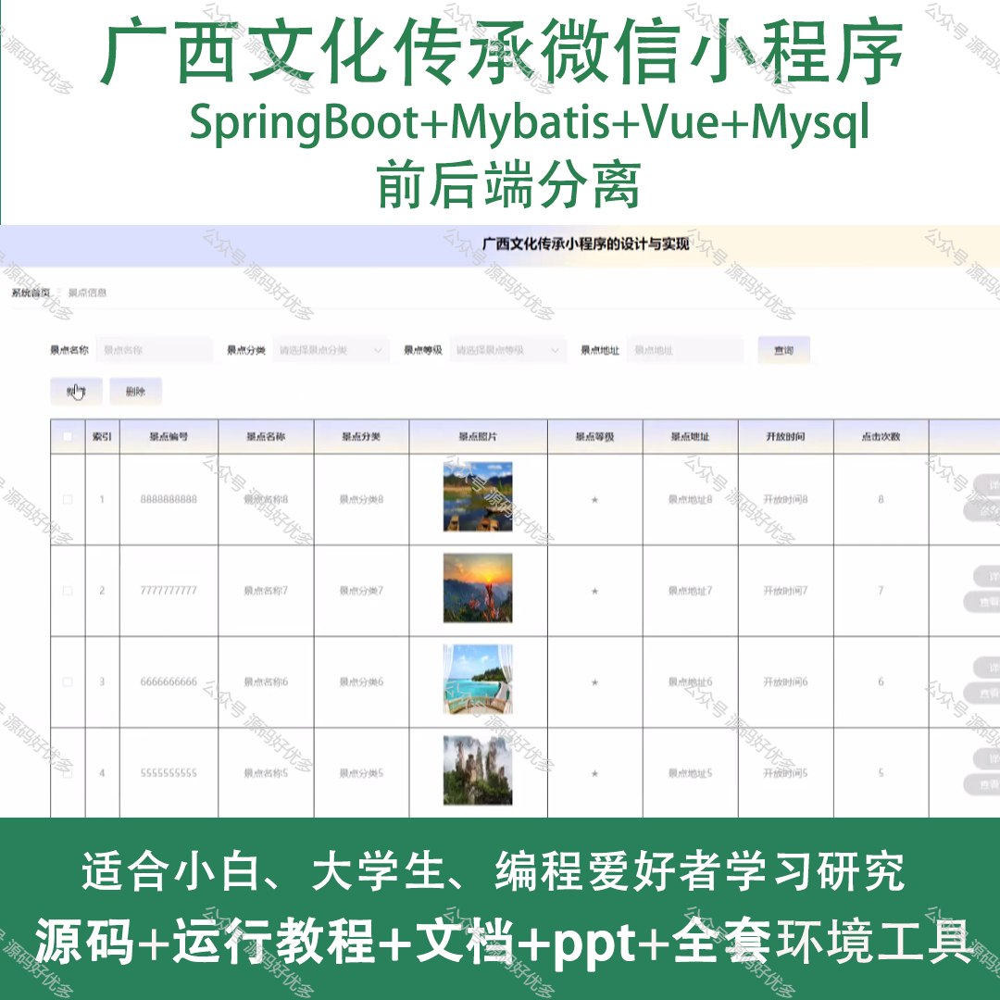
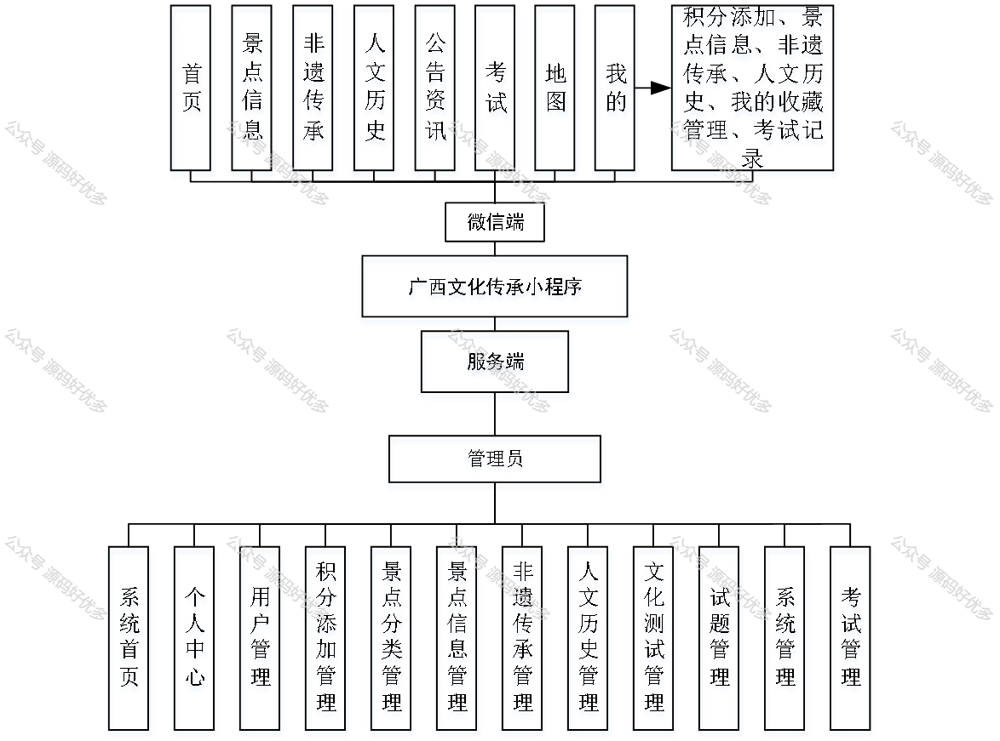
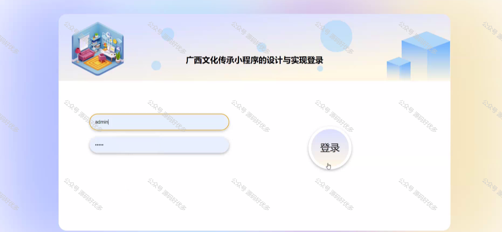

 
## 查看主页获取源码

> **作者介绍**： **✌**全网粉丝10W+本平台特邀作者、博客专家、CSDN新星计划导师、java领域优质创作者,博客之星、掘金/华为云/阿里云/InfoQ等平台优质作者、专注于项目实战 **✌**

  

### 一、作品包含

源码+数据库+设计文档万字+PPT+全套环境和工具资源+部署教程

### 二、项目技术

前端技术：Html、Css、Js、Vue、Element-ui

数据库：MySQL

后端技术：Java、Spring Boot、MyBatis

  

### 三、运行环境

开发工具：IDEA/eclipse + 微信开发者工具

数据库：MySQL5.7

数据库管理工具：Navicat10以上版本

环境配置软件： JDK1.8+Maven3.6.3

前端Nodejs：14

### 四、项目介绍
项目编号：mpweixinA028

广西文化传承微信小程序是一款致力于弘扬和传播广西壮族自治区丰富民族文化的移动应用平台。它汇集了广西的历史典故、民间艺术、传统节庆、非遗项目等多元文化内容，让用户能够随时随地了解和体验广西的独特文化魅力。小程序的推出，不仅为传统文化爱好者提供了一个学习交流的空间，也为广西文化的保护与传承注入了新的活力，促进了地方特色文化的传播与发展。

前台用户功能：首页、景点信息、非遗传承、人文历史、公告资讯、考试、地图、积分添加、景点信息、非遗传承、人文历史、我的收藏管理、考试记录。

后台管理员的功能：系统首页、个人中心、用户管理、积分添加管理、景点分类管理、景点信息管理、非遗传承管理、人文历史管理、文化测试管理、试题管理、系统管理和考试管理。

### 五、运行截图

  
